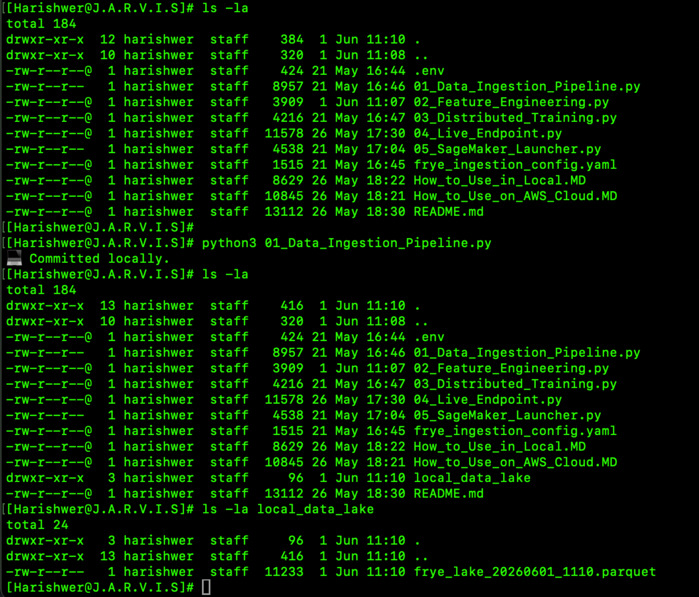
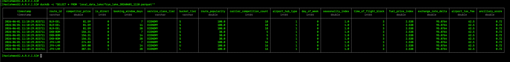
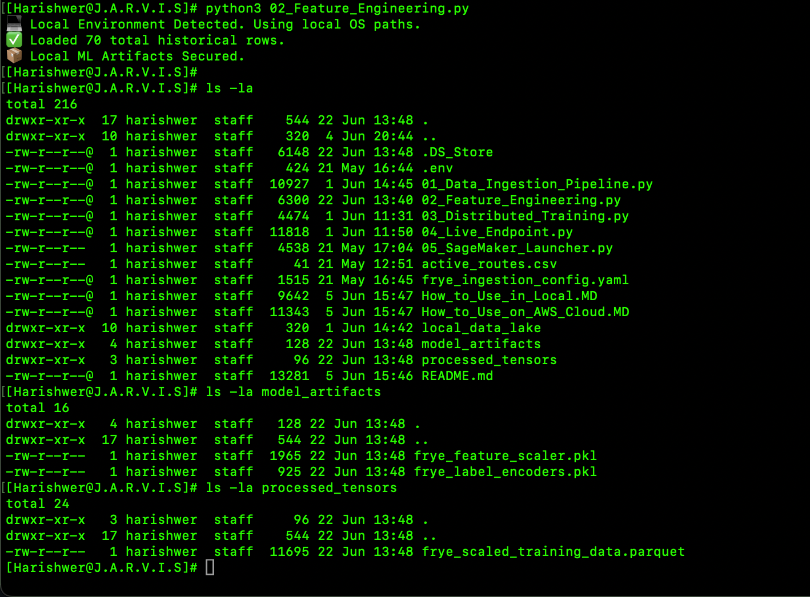
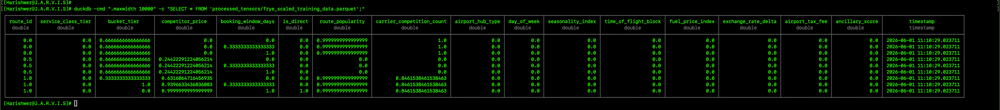
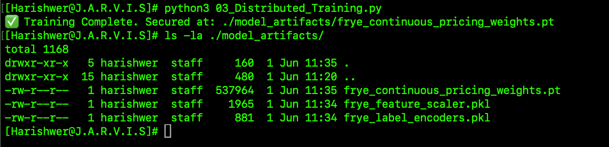
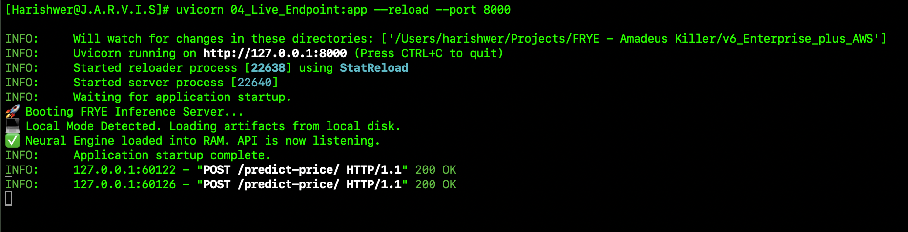
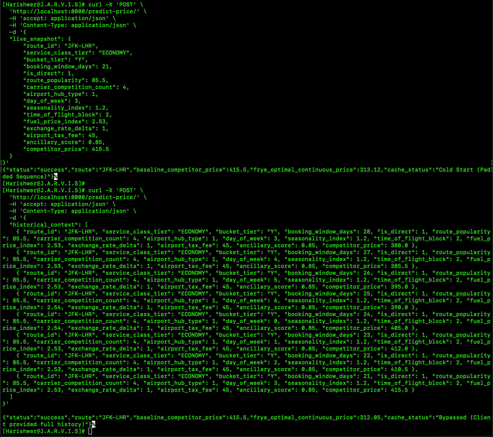

# 🚀 Project Almanac-FRYE: Local Development Guide
**Continuous Pricing Engine - Local Development & Testing Environment**

This guide outlines how to run Project Almanac-FRYE entirely on your local machine (Mac/PC). This environment is ideal for testing the data flow, debugging API rate limits, and experimenting with the neural network architecture before pushing to the cloud.

---

## 📂 Project Structure

Ensure your working directory contains the following core files:


```text
├── .env                              # Local API credentials (Do not commit)
├── frye_ingestion_config.yaml        # Pipeline parameters & API rate limits
├── active_routes.csv                 # (Optional) Dynamic route targets list
├── 01_Data_Ingestion_Pipeline.py     # Harvester (Hits Amadeus, AviationStack, EIA)
├── 02_Feature_Engineering.py         # Data Normalization (Scikit-learn, Parquet)
├── 03_Distributed_Training.py        # PyTorch Time-Series Transformer Engine
└── 04_Live_Endpoint.py               # FastAPI Inference Server

```

---

## 💻 Step-by-Step Execution

### Step 1: Environment Setup

1. Ensure **Python 3.10+** is installed on your system.
2. Install the required enterprise dependencies:
```bash
pip install pandas numpy requests python-dotenv pyarrow pyyaml scikit-learn torch transformers accelerate fastapi uvicorn boto3

```


3. Create a `.env` file in the root directory and add your API keys:
```env
AMADEUS_CLIENT_ID=your_key_here
AMADEUS_CLIENT_SECRET=your_secret_here
AVIATIONSTACK_API_KEY=your_key_here
EIA_API_KEY=your_key_here
EXCHANGERATE_API_KEY=your_key_here

```


### Step 2: Data Ingestion & Feature Engineering

> **🎯 Targeting Specific Routes (Optional):** > By default, the ingestion script harvests data for `JFK-LHR`, `BLR-DEL`, and `DXB-BOM`. To dynamically control which flight routes are harvested without altering the Python code, simply create an `active_routes.csv` file in this directory. Ensure it has a column header named `route_id` and list your target routes below it.

Generate the local Parquet data lake and Machine Learning artifacts (scalers/encoders). You should run the ingestion script periodically to build up at least 14 days of real-world data.

#### Automated Ingestion (Setting up a Cron Job)

To build a robust dataset automatically, set up a cron job to run the pipeline 4 times a day (every 6 hours).

1. Open your terminal and run `crontab -e`.
2. Add the following line (adjusting paths to your actual directory and python path):
```bash
0 0,6,12,18 * * * cd /path/to/project && /usr/local/bin/python3 01_Data_Ingestion_Pipeline.py >> ingestion_log.txt 2>&1

```


> **Alternative (Manual Runs):** If you prefer not to configure a cron job, you can manually run `python3 01_Data_Ingestion_Pipeline.py` a few times a day for at least 14 days to capture sufficient market volatility.





#### Feature Engineering

After you have collected sufficient data, run the feature engineering script to normalize the data and generate ML artifacts.

```bash
python3 02_Feature_Engineering.py

```

> **Note:** Ensure `UPLOAD_TO_S3 = False` inside `02_Feature_Engineering.py` when running purely locally.




### Step 3: Model Training

Train the Time-Series Transformer on your local machine.

```bash
python3 03_Distributed_Training.py

```

> **Apple Silicon (M-Series) Note:** The script features a dynamic hardware probe. It will automatically bypass the MPS (Metal) backend and route to your CPU. This is an intentional safety feature to prevent PyTorch from crashing on currently unsupported temporal indexing operations in Apple Metal.



### Step 4: Launch the Live Inference API

Boot the FastAPI server to serve live optimal price predictions.

```bash
uvicorn 04_Live_Endpoint:app --reload --port 8000

```

**Testing the API:**
You can test the API by opening **http://localhost:8000/docs** in your browser to use the interactive Swagger UI, or by sending a cURL request from your terminal.

**cURL Request Sample:**
>*Note: Because the API now uses In-Memory Cache to store the 8-day history, the client only needs to send a single snapshot of the current flight data.*

```bash
curl -X 'POST' \
  'http://localhost:8000/predict-price/' \
  -H 'accept: application/json' \
  -H 'Content-Type: application/json' \
  -d '{
  "live_snapshot": {
      "route_id": "JFK-LHR",
      "service_class_tier": "ECONOMY",
      "bucket_tier": "Y",
      "booking_window_days": 21,
      "is_direct": 1,
      "route_popularity": 85.5,
      "carrier_competition_count": 4,
      "airport_hub_type": 1,
      "day_of_week": 3,
      "seasonality_index": 1.2,
      "time_of_flight_block": 2,
      "fuel_price_index": 2.53,
      "exchange_rate_delta": 1,
      "airport_tax_fee": 45,
      "ancillary_score": 0.85,
      "competitor_price": 415.5
  }
}'
```


*The following cURL request format can be used, if we have to feed in a custome 8 consecutive historical snapshots for the Time-Series engine to predict the trend:*

```bash
curl -X 'POST' \
  'http://localhost:8000/predict-price/' \
  -H 'accept: application/json' \
  -H 'Content-Type: application/json' \
  -d '{
  "historical_context": [
    { "route_id": "JFK-LHR", "service_class_tier": "ECONOMY", "bucket_tier": "Y", "booking_window_days": 28, "is_direct": 1, "route_popularity": 85.5, "carrier_competition_count": 4, "airport_hub_type": 1, "day_of_week": 3, "seasonality_index": 1.2, "time_of_flight_block": 2, "fuel_price_index": 2.53, "exchange_rate_delta": 1, "airport_tax_fee": 45, "ancillary_score": 0.85, "competitor_price": 380.0 },
    { "route_id": "JFK-LHR", "service_class_tier": "ECONOMY", "bucket_tier": "Y", "booking_window_days": 27, "is_direct": 1, "route_popularity": 85.5, "carrier_competition_count": 4, "airport_hub_type": 1, "day_of_week": 4, "seasonality_index": 1.2, "time_of_flight_block": 2, "fuel_price_index": 2.53, "exchange_rate_delta": 1, "airport_tax_fee": 45, "ancillary_score": 0.85, "competitor_price": 385.5 },
    { "route_id": "JFK-LHR", "service_class_tier": "ECONOMY", "bucket_tier": "Y", "booking_window_days": 26, "is_direct": 1, "route_popularity": 85.5, "carrier_competition_count": 4, "airport_hub_type": 1, "day_of_week": 5, "seasonality_index": 1.2, "time_of_flight_block": 2, "fuel_price_index": 2.53, "exchange_rate_delta": 1, "airport_tax_fee": 45, "ancillary_score": 0.85, "competitor_price": 395.0 },
    { "route_id": "JFK-LHR", "service_class_tier": "ECONOMY", "bucket_tier": "Y", "booking_window_days": 25, "is_direct": 1, "route_popularity": 85.5, "carrier_competition_count": 4, "airport_hub_type": 1, "day_of_week": 6, "seasonality_index": 1.2, "time_of_flight_block": 2, "fuel_price_index": 2.54, "exchange_rate_delta": 1, "airport_tax_fee": 45, "ancillary_score": 0.85, "competitor_price": 390.0 },
    { "route_id": "JFK-LHR", "service_class_tier": "ECONOMY", "bucket_tier": "Y", "booking_window_days": 24, "is_direct": 1, "route_popularity": 85.5, "carrier_competition_count": 4, "airport_hub_type": 1, "day_of_week": 0, "seasonality_index": 1.2, "time_of_flight_block": 2, "fuel_price_index": 2.54, "exchange_rate_delta": 1, "airport_tax_fee": 45, "ancillary_score": 0.85, "competitor_price": 405.0 },
    { "route_id": "JFK-LHR", "service_class_tier": "ECONOMY", "bucket_tier": "Y", "booking_window_days": 23, "is_direct": 1, "route_popularity": 85.5, "carrier_competition_count": 4, "airport_hub_type": 1, "day_of_week": 1, "seasonality_index": 1.2, "time_of_flight_block": 2, "fuel_price_index": 2.53, "exchange_rate_delta": 1, "airport_tax_fee": 45, "ancillary_score": 0.85, "competitor_price": 412.0 },
    { "route_id": "JFK-LHR", "service_class_tier": "ECONOMY", "bucket_tier": "Y", "booking_window_days": 22, "is_direct": 1, "route_popularity": 85.5, "carrier_competition_count": 4, "airport_hub_type": 1, "day_of_week": 2, "seasonality_index": 1.2, "time_of_flight_block": 2, "fuel_price_index": 2.53, "exchange_rate_delta": 1, "airport_tax_fee": 45, "ancillary_score": 0.85, "competitor_price": 410.5 },
    { "route_id": "JFK-LHR", "service_class_tier": "ECONOMY", "bucket_tier": "Y", "booking_window_days": 21, "is_direct": 1, "route_popularity": 85.5, "carrier_competition_count": 4, "airport_hub_type": 1, "day_of_week": 3, "seasonality_index": 1.2, "time_of_flight_block": 2, "fuel_price_index": 2.53, "exchange_rate_delta": 1, "airport_tax_fee": 45, "ancillary_score": 0.85, "competitor_price": 415.5 }
  ]
}'

```





---

## 🛠️ Local Troubleshooting

* **400 Bad Request:** The neural network mathematically requires exactly 8 historical snapshots to predict the next price. If you send 1 or 7, the API will reject it.
* **500 Scaler Dimension Error:** The `MinMaxScaler` expects exactly 16 columns (15 features + the baseline price). Do not alter the `SCALER_ORDERED_FEATURES` array in the inference script.
* **Negative Prices Predicted:** Ensure the `FRYEContinuousPricingEngine` class definition in `04_Live_Endpoint.py` contains `self.activation = nn.Sigmoid()` in the final layer to enforce positive price boundaries.

---
