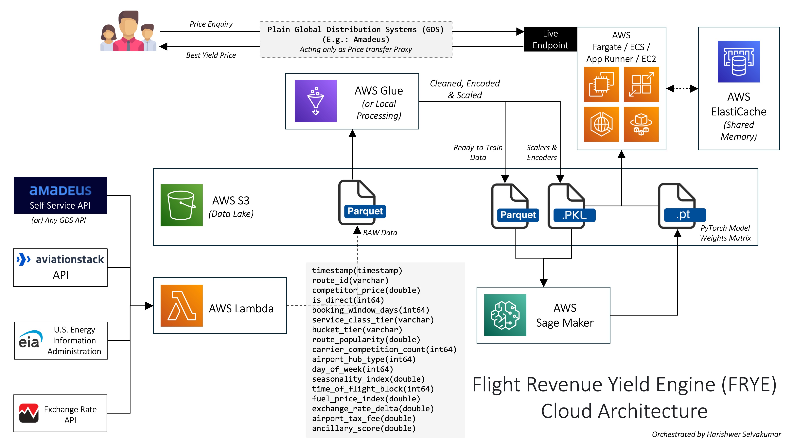
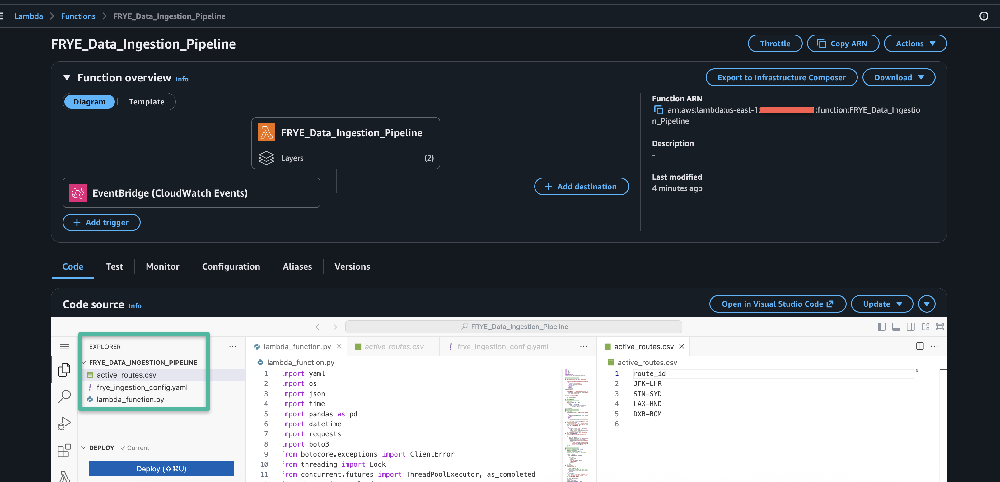
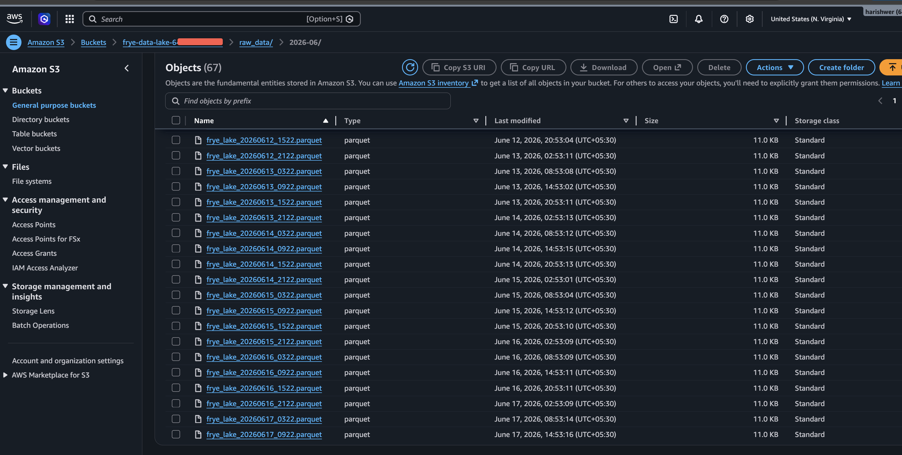

# ☁️ Project Almanac-FRYE: AWS Cloud Production Guide
**Continuous Pricing Engine - Serverless MLOps Pipeline**

This guide outlines how to deploy Project Almanac-FRYE as a highly elastic, serverless MLOps pipeline on AWS. This architecture maps specific workloads to the appropriate AWS compute services, such as AWS Lambda for automated data collection, Amazon S3 for the Data Lake, and AWS SageMaker for on-demand GPU training.

---

## 📂 Cloud Project Structure & Infrastructure Mapping

Where does each script run in the AWS ecosystem?

* **`frye_ingestion_config.yaml` & `active_routes.csv`**: Uploaded directly inside **AWS Lambda** alongside script 01. The CSV is optional but recommended for dynamically managing flight targets without altering Python code.
* **`01_Data_Ingestion_Pipeline.py`**: Runs in **AWS Lambda** (Triggered by EventBridge).
* **`02_Feature_Engineering.py`**: Runs **Locally** (or via AWS Glue/SageMaker Processing Jobs for massive scale).
* **`03_Distributed_Training.py`**: Runs in **AWS SageMaker** (NVIDIA GPU Cluster).
* **`04_Live_Endpoint.py`**: Runs in **AWS Fargate, App Runner, ECS, or EC2** (Stateless API Container connected to ElastiCache).
* **`05_SageMaker_Launcher.py`**: Runs in **AWS Lambda** or **Locally** (Orchestrates the SageMaker Cluster).



---

## ☁️ Step-by-Step Deployment

### Step 1: AWS Credentials & Permissions

Instead of local `.env` files, production deployments use **AWS Secrets Manager**.

1. Navigate to AWS Secrets Manager and create a secret named `frye_api_keys`.
2. Add all API keys as Key/Value pairs.
3. Add your SageMaker Execution Role ARN:
* `SAGEMAKER_ROLE_ARN` : `arn:aws:iam::YOUR_ACCOUNT_ID:role/service-role/AmazonSageMaker-ExecutionRole`


4. Ensure your IAM Execution Roles have `AmazonS3FullAccess`, `AmazonSageMakerFullAccess`, and `SecretsManagerReadWrite`.

### Step 2: Automated Data Ingestion (Lambda + EventBridge)

Deploy script `01_Data_Ingestion_Pipeline.py` to automate real-world data collection.

1. Create an **AWS Lambda** function.
2. **Uploading the Code:** You must upload your core ingestion files to the root directory of your Lambda function. You can do this by zipping them together or editing them directly in the Lambda console.
   * Required: `01_Data_Ingestion_Pipeline.py` and `frye_ingestion_config.yaml`.
   * Optional: `active_routes.csv`. If included, the Lambda will automatically harvest your custom list of routes; if omitted, it safely falls back to a default trio of routes.
3. **Handling Dependencies (AWS Lambda Layers):** Lambda requires external packages. Instead of uploading massive `.zip` files:
   * **The Heavy Math:** Go to your Lambda function -> **Layers** -> **Add a layer**. Select **AWS layers** and choose **AWSSDKPandas-Python310**. (This provides `pandas`, `numpy`, and `pyarrow`).
   * **The Network/Parsing/Cache:** You must create a custom layer for `requests`, `pyyaml`, `python-dotenv`, and `redis`. On your Mac, run:
    ```bash
     mkdir -p python/lib/python3.10/site-packages
     pip3 install requests pyyaml python-dotenv redis -t python/lib/python3.10/site-packages/
     zip -r custom_lambda_layer.zip python
    ```
     Upload `custom_lambda_layer.zip` to the AWS Lambda Layers console, then attach that custom layer to your function alongside the AWS Pandas layer.
4. **Critical Lambda Configurations:**
   * **Timeout:** Set to **15 minutes** (Configuration > General Configuration).
   * **Environment Variables:**
     * `AWS_EXECUTION_ENV` = `True`
     * `INGESTION_START_DATE` = `YYYY-MM-DD` (Today's date)
     * `EVENTBRIDGE_RULE_NAME` = `frye-ingestion-cron`
5. Attach an **EventBridge Trigger** (Cron expression: `rate(6 hours)` or `0 */6 * * ? *`) to run it automatically 4x a day.



### Step 3: Granting Auto-Shutdown Permissions (GUI Method)

By default, AWS Lambda does not have permission to turn off its own EventBridge trigger. To enable the 15-day auto-kill switch, we must grant it permission using the visual console. We will use the Visual Editor to prevent any errors with copying Account IDs or ARNs.

**Navigating to the Execution Role:**
1. Open your `FRYE_Data_Ingestion_Pipeline` function in the AWS Lambda console.
2. Click on the **Configuration** tab.
3. Select **Permissions** from the left-hand sidebar.
4. Under the **Execution role** section at the top, click the blue link under **Role name** (this will open the IAM console in a new tab).

**Adding the Permission:**

5. In the new IAM tab, click the **Add permissions** dropdown button on the right, then select **Create inline policy**.
6. Ensure you are on the **Visual** tab in the policy editor (do not click JSON).
7. Under **Select a service**, search for and click on **EventBridge**.
8. Under **Actions allowed**, type `DisableRule` into the "Filter actions" search bar.
9. Check the box next to **DisableRule** (found under the *Write* category).
10. Scroll down to the **Resources** section and select the radio button for **All** (This safely bypasses the need to type out specific ARNs or Account Numbers).
11. Click the **Next** button at the bottom of the screen.
12. For the **Policy name**, enter `Frye-Lifecycle-Manager`.
13. Click **Create policy**.

Your Lambda function is now fully authorized to automatically disable its own ingestion cron job after the 15-day lifecycle completes.

### Step 4: Cloud Feature Engineering (S3 Integration)

After Lambda has collected at least 14 days of real-world data in S3, run script `02_Feature_Engineering.py` to process it.

* **Where to run:** Because this script requires loading the entire historical dataset into RAM to calculate scaler bounds, run it **locally on your machine** (or deploy it to a high-memory AWS Glue job).
* Ensure `UPLOAD_TO_S3 = True` inside `02_Feature_Engineering.py`.
* Run the script. It will read raw Parquet data from S3, normalize it, and push the ML artifacts (`.pkl` scalers) and `frye_scaled_training_data.parquet` back to your S3 bucket.



### Step 5: Automated GPU Training (AWS SageMaker)

Once the processed tensors are in S3, launch the cloud training cluster. You can run script `05_SageMaker_Launcher.py` locally or deploy it to a separate Lambda function.
```bash
python3 05_SageMaker_Launcher.py
```

**The Cloud CI/CD Workflow:**

1. Script `05_SageMaker_Launcher.py` tells AWS to provision an `ml.g4dn.xlarge` NVIDIA GPU instance.
2. SageMaker pulls `03_Distributed_Training.py` and the S3 Parquet tensors and trains the PyTorch model.
3. **Model Promotion:** Script `05_SageMaker_Launcher.py` automatically copies the finalized weights to a static S3 path (`model_output/latest_model.tar.gz`).

### Step 6: Stateless Inference API Deployment

Deploy `04_Live_Endpoint.py` to a cloud server meant for continuous API hosting, such as **AWS Fargate, ECS, App Runner, or an EC2 instance**.

* **Redis ElastiCache Setup:** Provision an Amazon ElastiCache (Redis) cluster. This acts as the centralized Feature Store for your API so it can remember the historical context of incoming flight requests.
* **Environment Variables:** Set these variables on your container:
* `FORCE_S3_PULL=true`
* `REDIS_HOST=your-elasticache-endpoint.amazonaws.com`
* `REDIS_PORT=6379`
* **Stateless Boot:** On startup, FastAPI will automatically connect to S3, download the `latest_model.tar.gz` and the scalers, extract them, and load them into RAM. It will then connect to Redis to handle state.

**Testing the Cloud API:**
Once deployed, send a request to your API's public IP or domain name.

**cURL Request Sample (Live Snapshot Architecture):**
> *Note: Because the API now uses Redis to store the 8-day history, the client only needs to send a single snapshot of the current flight data. Replace `YOUR_AWS_ENDPOINT_URL` with your actual Fargate/EC2 endpoint.*

```bash
curl -X 'POST' \
  'http://YOUR_AWS_ENDPOINT_URL/predict-price/' \
  -H 'accept: application/json' \
  -H 'Content-Type: application/json' \
  -d '{
  "live_snapshot": {
      "route_id": "JFK-LHR",
      "service_class_tier": "ECONOMY",
      "bucket_tier": "Y",
      "booking_window_days": 21,
      "is_direct": 1,
      "route_popularity": 85.5,
      "carrier_competition_count": 4,
      "airport_hub_type": 1,
      "day_of_week": 3,
      "seasonality_index": 1.2,
      "time_of_flight_block": 2,
      "fuel_price_index": 2.53,
      "exchange_rate_delta": 1,
      "airport_tax_fee": 45,
      "ancillary_score": 0.85,
      "competitor_price": 415.5
  }
}'
```

*The following cURL request format can be used, if we have to feed in the custom 8 consecutive historical snapshots for the Time-Series engine to predict the trend:*

```bash
curl -X 'POST' \
  'http://YOUR_AWS_ENDPOINT_URL/predict-price/' \
  -H 'accept: application/json' \
  -H 'Content-Type: application/json' \
  -d '{
  "historical_context": [
    { "route_id": "JFK-LHR", "service_class_tier": "ECONOMY", "bucket_tier": "Y", "booking_window_days": 28, "is_direct": 1, "route_popularity": 85.5, "carrier_competition_count": 4, "airport_hub_type": 1, "day_of_week": 3, "seasonality_index": 1.2, "time_of_flight_block": 2, "fuel_price_index": 2.53, "exchange_rate_delta": 1, "airport_tax_fee": 45, "ancillary_score": 0.85, "competitor_price": 380.0 },
    { "route_id": "JFK-LHR", "service_class_tier": "ECONOMY", "bucket_tier": "Y", "booking_window_days": 27, "is_direct": 1, "route_popularity": 85.5, "carrier_competition_count": 4, "airport_hub_type": 1, "day_of_week": 4, "seasonality_index": 1.2, "time_of_flight_block": 2, "fuel_price_index": 2.53, "exchange_rate_delta": 1, "airport_tax_fee": 45, "ancillary_score": 0.85, "competitor_price": 385.5 },
    { "route_id": "JFK-LHR", "service_class_tier": "ECONOMY", "bucket_tier": "Y", "booking_window_days": 26, "is_direct": 1, "route_popularity": 85.5, "carrier_competition_count": 4, "airport_hub_type": 1, "day_of_week": 5, "seasonality_index": 1.2, "time_of_flight_block": 2, "fuel_price_index": 2.53, "exchange_rate_delta": 1, "airport_tax_fee": 45, "ancillary_score": 0.85, "competitor_price": 395.0 },
    { "route_id": "JFK-LHR", "service_class_tier": "ECONOMY", "bucket_tier": "Y", "booking_window_days": 25, "is_direct": 1, "route_popularity": 85.5, "carrier_competition_count": 4, "airport_hub_type": 1, "day_of_week": 6, "seasonality_index": 1.2, "time_of_flight_block": 2, "fuel_price_index": 2.54, "exchange_rate_delta": 1, "airport_tax_fee": 45, "ancillary_score": 0.85, "competitor_price": 390.0 },
    { "route_id": "JFK-LHR", "service_class_tier": "ECONOMY", "bucket_tier": "Y", "booking_window_days": 24, "is_direct": 1, "route_popularity": 85.5, "carrier_competition_count": 4, "airport_hub_type": 1, "day_of_week": 0, "seasonality_index": 1.2, "time_of_flight_block": 2, "fuel_price_index": 2.54, "exchange_rate_delta": 1, "airport_tax_fee": 45, "ancillary_score": 0.85, "competitor_price": 405.0 },
    { "route_id": "JFK-LHR", "service_class_tier": "ECONOMY", "bucket_tier": "Y", "booking_window_days": 23, "is_direct": 1, "route_popularity": 85.5, "carrier_competition_count": 4, "airport_hub_type": 1, "day_of_week": 1, "seasonality_index": 1.2, "time_of_flight_block": 2, "fuel_price_index": 2.53, "exchange_rate_delta": 1, "airport_tax_fee": 45, "ancillary_score": 0.85, "competitor_price": 412.0 },
    { "route_id": "JFK-LHR", "service_class_tier": "ECONOMY", "bucket_tier": "Y", "booking_window_days": 22, "is_direct": 1, "route_popularity": 85.5, "carrier_competition_count": 4, "airport_hub_type": 1, "day_of_week": 2, "seasonality_index": 1.2, "time_of_flight_block": 2, "fuel_price_index": 2.53, "exchange_rate_delta": 1, "airport_tax_fee": 45, "ancillary_score": 0.85, "competitor_price": 410.5 },
    { "route_id": "JFK-LHR", "service_class_tier": "ECONOMY", "bucket_tier": "Y", "booking_window_days": 21, "is_direct": 1, "route_popularity": 85.5, "carrier_competition_count": 4, "airport_hub_type": 1, "day_of_week": 3, "seasonality_index": 1.2, "time_of_flight_block": 2, "fuel_price_index": 2.53, "exchange_rate_delta": 1, "airport_tax_fee": 45, "ancillary_score": 0.85, "competitor_price": 415.5 }
  ]
}'
```

---

## 🛠️ Cloud Troubleshooting & Limits

* **Lambda Timeout Errors:** If the ingestion script or the SageMaker Launcher times out, ensure you have increased the default AWS Lambda timeout from 3 seconds to 15 minutes.
* **SageMaker Quotas:** If `05_SageMaker_Launcher.py` fails to launch the cluster, check your AWS Service Quotas. Some new AWS accounts require a manual limit increase request for `ml.g4dn.xlarge` instances for SageMaker Training.
* **S3 Namespace Collisions:** The scripts dynamically generate a bucket name using your AWS Account ID (`FRYE-data-lake-123456789012`) to completely avoid global S3 naming collisions.

---
